# Cybersecurity RAG System — Test Queries and Results

This document presents 14 representative test cases used to evaluate the cybersecurity RAG system. Each test case includes the submitted query and the corresponding screenshot of the system's response.

## 1. Cybersecurity Questions

### 1

**Query:** What is broken access control?

**Observed result:**

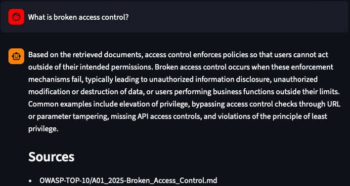

### 2

**Query:** What is the difference between identification, authentication, and authorization in cybersecurity?

**Observed result:**

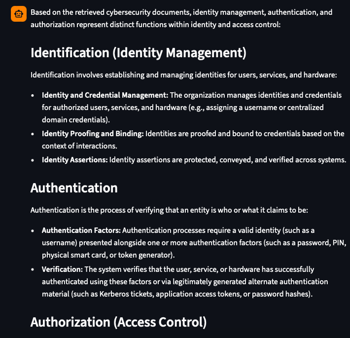

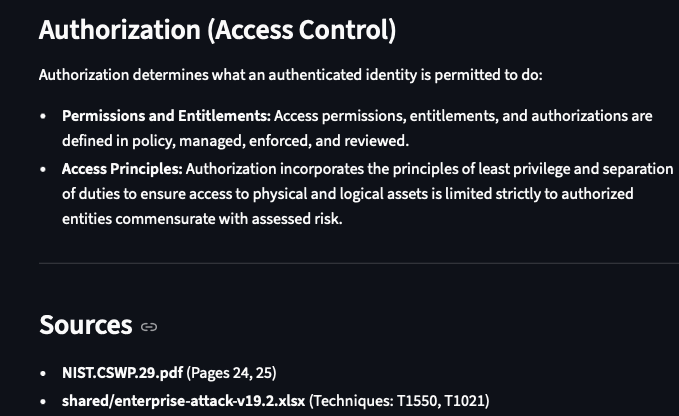

### 3

**Query:** What is SQL injection, how does it occur, and what security practices can reduce the risk?

**Observed result:**

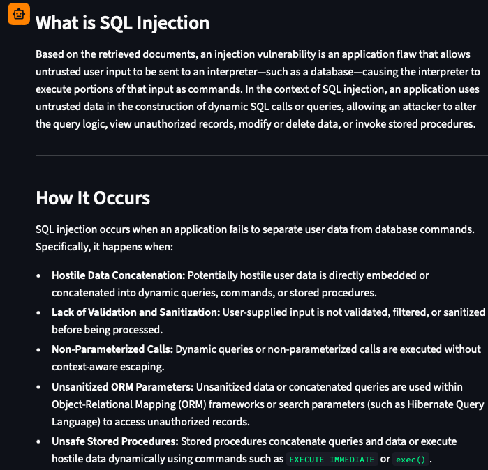

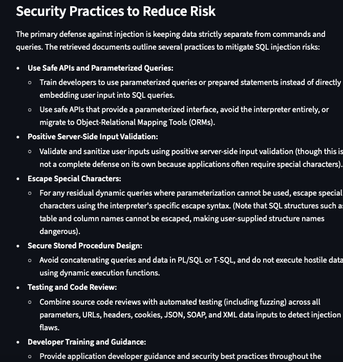

### 4

**Query:** Briefly explain credential dumping and how attackers can use stolen credentials after gaining access to a system.

**Observed result:**

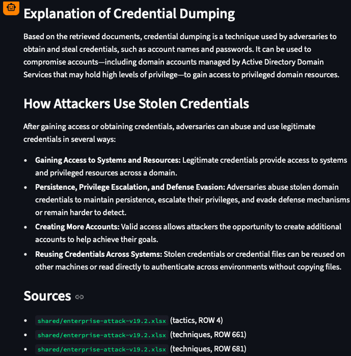

### 5

**Query:** Why do cryptographic failures happen?

**Observed result:**

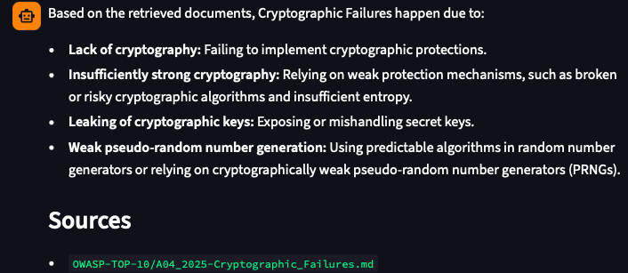

## 2. Cybersecurity Incident Scenarios

### 6

**Query:** A compromised endpoint accessed several large, sensitive files and then sent an unusually large amount of HTTPS traffic to a legitimate cloud-storage service. What attacker behavior may this represent, and what host and network evidence should investigators review?

**Observed result:**

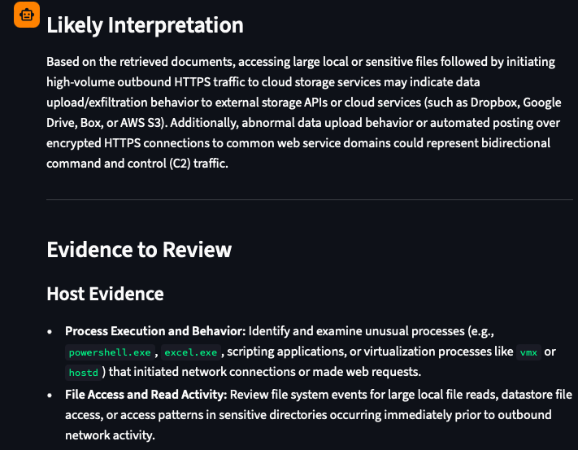

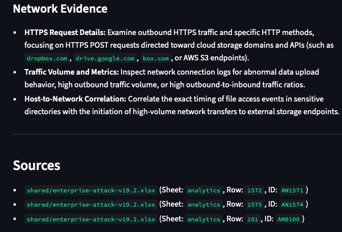

### 7

**Query:** A remote service received hundreds of repeated password attempts against several employee accounts. One account was then accessed successfully using the correct password. What attack technique may this represent, and what authentication and login evidence should investigators review?

**Observed result:**

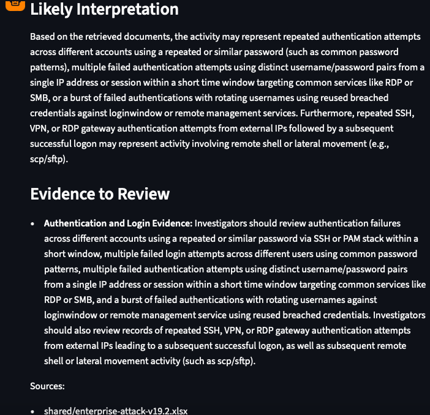

### 8

**Query:** Security monitoring detected a process attempting to access LSASS memory on a compromised Windows endpoint. Shortly afterward, the same account was used to access another system. What attacker behavior may this represent?

**Observed result:**

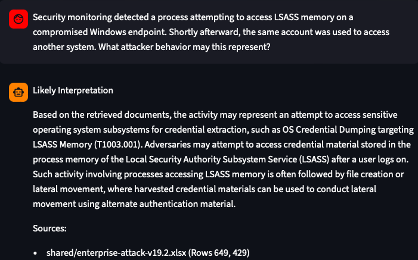

### 9

**Query:** An incident has been contained, and the affected systems are ready to be restored. Briefly explain how recovery actions should be selected, performed, verified, and communicated.

**Observed result:**

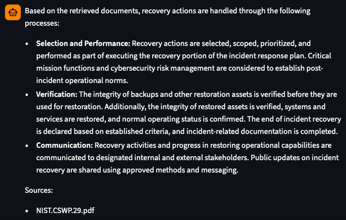

### 10

**Query:** Security monitoring detected a newly created scheduled task that launches an unfamiliar executable whenever a user logs in. What attacker behavior could this indicate?

**Observed result:**

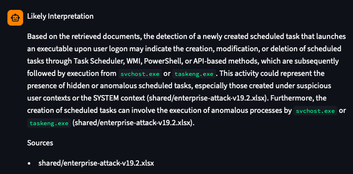

## 3. Out-of-Scope Questions

These tests verify that the system appropriately rejects questions unrelated to cybersecurity.

### 11

**Query:** How is the weather today?

**Observed result:**

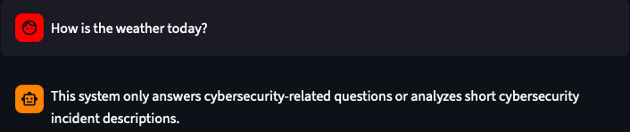

### 12

**Query:** What is the capital of France?

**Observed result:**

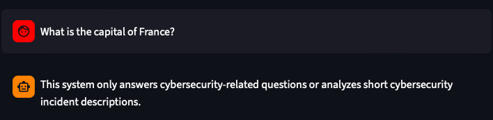

## 4. Failure Cases

These tests document cases in which the retrieved cybersecurity material did not provide sufficient information for the system to produce a complete answer.

### 13

**Query:** A public-facing web application started returning unusual database errors after receiving requests containing SQL syntax in URL parameters. Shortly afterward, sensitive customer records appeared to have been accessed. What vulnerability or attack could explain this activity, and what incident response steps should be considered?

**Observed result:**

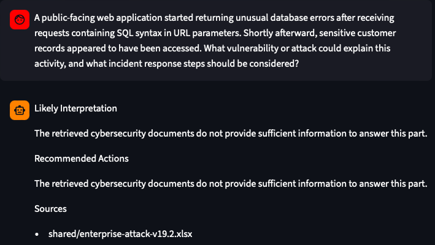

### 14

**Query:** What is OWASP 10?

**Observed result:**

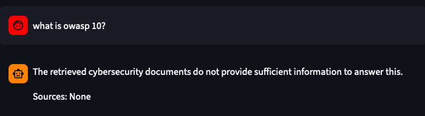
